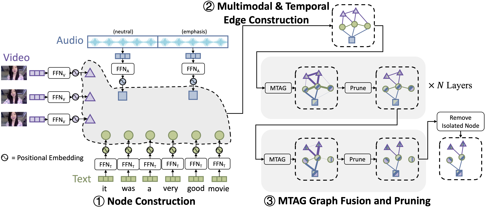

**Paper: https://aclanthology.org/2021.naacl-main.79**

**Talk: https://www.youtube.com/watch?v=b0UogJP4U5I**


MTAG (Modal-Temporal Attention Graph) is a GNN-based machine learning framework that can learn fusion and alignment for unaligned multimodal sequences.

Our code is written as an extension to the awesome [PyTorch Geometric](https://github.com/rusty1s/pytorch_geometric) library. Users are encouraged to read their [installation guide](https://pytorch-geometric.readthedocs.io/en/latest/notes/installation.html) and documentations to understand the basics.

Our main contributions include:
 - A [graph builder](https://github.com/jedyang97/MTAG/blob/main/graph_model/graph_builder.py) to construct graphs with modal and temporal edges.
 - A new GNN convolution operation called [MTGATConv](https://github.com/jedyang97/MTAG/blob/main/graph_model/mtgat_conv.py) that uses distinct attentions for edges with distinct modality and temporal ordering. It also transforms each node based on its modality type. It is like a combination of [RGCNConv](https://pytorch-geometric.readthedocs.io/en/latest/modules/nn.html#torch_geometric.nn.conv.RGCNConv) and [GATConv](https://pytorch-geometric.readthedocs.io/en/latest/modules/nn.html#torch_geometric.nn.conv.GATConv) with an efficient implementation. We hope this operation can be inlcuded into [PyTorch Geometric](https://github.com/rusty1s/pytorch_geometric) as a standard operation.
 - A [TopK pooling](https://github.com/jedyang97/MTAG/blob/main/graph_model/pooling.py) operation to prune edges with low attention weights.
## Installation

Please refer to the `requirement.txt` for setup.

## Dataset Preperation
Download the following datasets (please copy and paste the URL to browser, as clicking the link might not work):

- CMU-MOSI Unaligned Sequence: https://www.dropbox.com/s/byb2togk2oj2shy/mosi_data_noalign.pkl?dl=0
- IEMOCAP Unaligned Sequence: https://www.dropbox.com/s/cgbb3hh9bn7a6gb/iemocap_data_noalign.pkl?dl=0
- Other datasets in the same format: https://www.dropbox.com/sh/kv6fqk3es7xno7c/AAA2G0V-wu7cOZoqLU3JEml8a?dl=0, which includes:
  - CMU-MOSI (aligned and unaligned)
  - IEMOCAP (aligned and unaligned)
  - CMU-MOSEI (aligned and unaligned)

and put them into a desired folder (.e.g. ```<dataroot>```). Then specify in ```run.sh``` the folder containing the data of the desired dataset. For example:


```
python main.py \
...
--dataroot <dataroot>
...
```    

## Running Example

```
bash run.sh
```

To visualize the edges:
```
jupyter notebook network_inference_visualize.ipynb
```

## Hyperparameters

A more comprehensive hyperparameter list (along with each setting's performance we obtained) can be found in this [Google Sheet](https://docs.google.com/spreadsheets/d/1Jbp7VOKnMkRJBAGi2gomK5AFPGZQLGUezFqAPWJWk80/edit?usp=sharing). For any parameters that are not specified here, we used the default values in `main.py`.

## Citation

```
@inproceedings{yang-etal-2021-mtag,
    title = "{MTAG}: Modal-Temporal Attention Graph for Unaligned Human Multimodal Language Sequences",
    author = "Yang, Jianing  and
      Wang, Yongxin  and
      Yi, Ruitao  and
      Zhu, Yuying  and
      Rehman, Azaan  and
      Zadeh, Amir  and
      Poria, Soujanya  and
      Morency, Louis-Philippe",
    booktitle = "Proceedings of the 2021 Conference of the North American Chapter of the Association for Computational Linguistics: Human Language Technologies",
    month = jun,
    year = "2021",
    address = "Online",
    publisher = "Association for Computational Linguistics",
    url = "https://www.aclweb.org/anthology/2021.naacl-main.79",
    pages = "1009--1021",
    abstract = "Human communication is multimodal in nature; it is through multiple modalities such as language, voice, and facial expressions, that opinions and emotions are expressed. Data in this domain exhibits complex multi-relational and temporal interactions. Learning from this data is a fundamentally challenging research problem. In this paper, we propose Modal-Temporal Attention Graph (MTAG). MTAG is an interpretable graph-based neural model that provides a suitable framework for analyzing multimodal sequential data. We first introduce a procedure to convert unaligned multimodal sequence data into a graph with heterogeneous nodes and edges that captures the rich interactions across modalities and through time. Then, a novel graph fusion operation, called MTAG fusion, along with a dynamic pruning and read-out technique, is designed to efficiently process this modal-temporal graph and capture various interactions. By learning to focus only on the important interactions within the graph, MTAG achieves state-of-the-art performance on multimodal sentiment analysis and emotion recognition benchmarks, while utilizing significantly fewer model parameters.",
}
```
